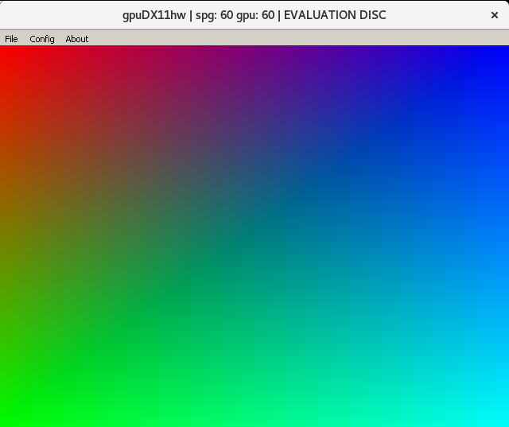

# dreamcast-cpp-template
A getting started template for programming the Dreamcast. This readme is an accompanying guide that goes over building a toolchain and provides a short project walkthru. 

# Getting a toolchain
You'll need to install the following programs to get started.
* [Binutils](http://ftp.gnu.org/gnu/binutils/)
* [GCC](https://gcc.gnu.org/mirrors.html)
* [Newlib](https://sourceware.org/newlib/)

Download and decompress the files. Create a directory called 'build.' Your directory should look like so:


You should now enter the build directory to continue.

## Building Binutils
From the build directory run the following:
```bash
../binutils*/configure --target=sh-elf && make -j
```
If the build succeeded go ahead and install the program with `sudo make install`. If you'd like to verify the install went well run `sh-elf-ld --version` and check the output. Delete all the files in the build directory.

## Building a bootstrap GCC
Before you attempt to build make sure you have the correct libraries installed. See [GCC Prerequisite](https://gcc.gnu.org/install/prerequisites.html) page for more information. From the build directory run the following:
```bash
../gcc*/configure --target=sh-elf --enable-languages=c,c++ --with-newlib --disable-libgcc --disable-libstdc++-v3 --disable-libquadmath --disable-libssp --disable-tls && make -j
```
If the build succeeded go ahead and install the program with `sudo make install`. If you'd like to verify the install went well run `sh-elf-gcc --version` and check the output. Delete all the files in the build directory.

## Building Newlib
From the build directory run the following:
```bash
../newlib*/configure --target=sh-elf --enable-newlib-nano-malloc
```
If the build succeeded go ahead and install the program with `sudo make install`. Delete all the files in the build directory.

## Building GCC
From the build directory run the following:
```bash
../gcc*/configure --target=sh-elf --enable-languages=c,c++ --with-newlib && make -j
```
If the build succeeded go ahead and install the program with `sudo make install`. You should now have a working toolchain.

## Verify working toolchain

Run `make` from the root directory of this project. The project should build and start running an emulator. The emulator should display the following:



If you see this you're ready to start programming the Dreamcast. You should be able to burn test.cdi to a CD-R and run the program on real hardware.

# Exploring this project

With a working toolchain you can begin programming the Dreamcast. In this section I'll provide a project walkthru to aid in understanding how one may construct larger projects. In a future blog post I'll go into more detail on the Dreamcast's hardware architecture.

## The Makefile
The first thing that should be noted are the top most variables `EMU`, `SCR`, `CDI`, `ISO`, `CC`, `CXX`, `AS`, `LD`, `AR`, `OBJ` and, `NM`. These are the tools that I use for making Dreamcast programs. I'll go over these in more detail in the tooling section of this document but, for now know that these are tools that can be used for building programs.

Following that we have flags for building the program. The most important flags are `CFLAGS` and `CXXFLAGS`. The `ml` switch tells the compiler we want little endian code. The `m4-single` switch tells the compiler we want SH-4 code with a bias towards using 32-bit floating point variables if floating point variables are to be used. The switches `ffreestanding` and `nostartfiles` are used because we have no operating system. At the end of `CFLAGS` we have `-Wl,-Ttext=0x8C010000`. The `Wl` switch passes a comma separated list to the linker. In this case we only pass `-Ttext=0x8C010000`. This tells the linker that the text region, which is where the program code is, should be at 0x8C010000.

We have 2 rules in this makefile.

## The Tooling


## The main.cpp


# TODO
* Make a linker script.
* Add a makefile rule for uploading image over serial / lan.
* Add a makefile rule for burning disc image.
