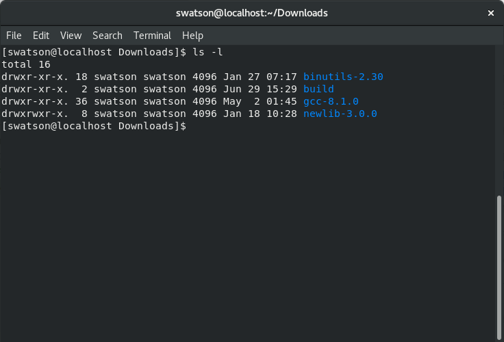

# dreamcast-cpp-template
A getting started template for programming the Dreamcast.

# Getting a toolchain
You'll need to install the following programs to get started.
* [Binutils](http://ftp.gnu.org/gnu/binutils/)
* [GCC](https://gcc.gnu.org/mirrors.html)
* [Newlib](https://sourceware.org/newlib/)

Download and decompress the files. Create a directory called 'build.' Your directory should look like so:



You should now enter the build directory to continue.

## Building Binutils
From the build directory run the following:
```bash
../binutils*/configure --target=sh-elf && make -j
```
If the build succeeded go ahead and install the program with `sudo make install`. If you'd like to verify the install went well run `sh-elf-ld --version` and check the output. Delete all the files in the build directory.

## Building a bootstrap GCC
Before you attempt to build make sure you have the correct libraries installed. See [GCC Prerequisite](https://gcc.gnu.org/install/prerequisites.html) page for more information. From the build directory run the following:
```bash
../gcc*/configure --target=sh-elf --enable-languages=c,c++ --with-newlib --disable-libgcc --disable-libstdc++-v3 --disable-libquadmath --disable-libssp --disable-tls && make -j
```
If the build succeeded go ahead and install the program with `sudo make install`. If you'd like to verify the install went well run `sh-elf-gcc --version` and check the output. Delete all the files in the build directory.

## Building Newlib
From the build directory run the following:
```bash
../newlib*/configure --target=sh-elf --enable-newlib-nano-malloc
```
If the build succeeded go ahead and install the program with `sudo make install`. Delete all the files in the build directory.

## Building GCC
From the build directory run the following:
```bash
../gcc*/configure --target=sh-elf --enable-languages=c,c++ --with-newlib && make -j
```
If the build succeeded go ahead and install the program with `sudo make install`. You should now have a working toolchain.

## Verify working toolchain

Run `make` from the root directory of this project and see that all compiles well.

# Exploring this project

## The Makefile


## The Tooling


## The main.cpp


# TODO
Make a linker script.